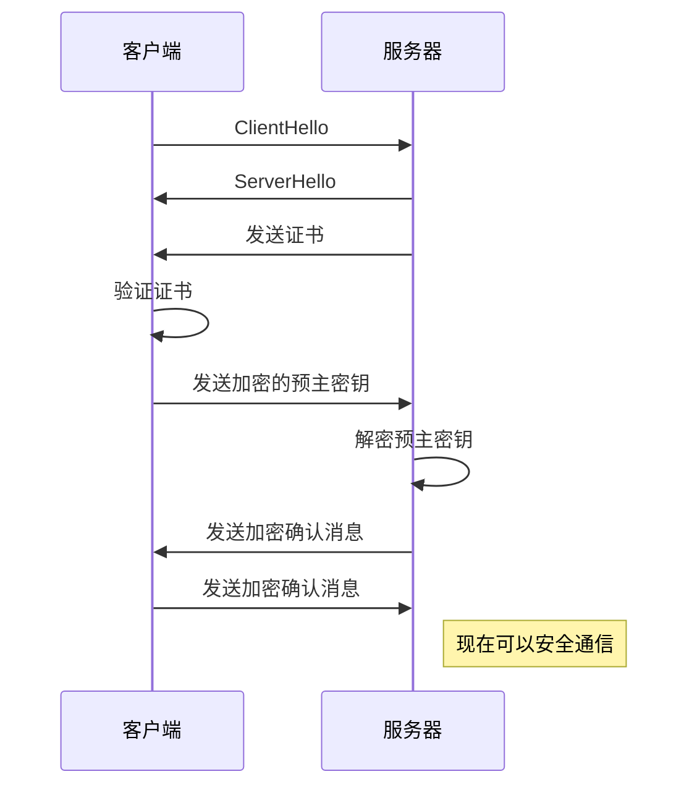

余弦相似度是一种用于衡量两个非零向量在空间中夹角的相似度的度量。它常用于信息检索和文本挖掘中，尤其是在比较文档或用户之间的相似性时。 (doc-chat.3dea73fa6e209cdc9cf1.js, line 1)

余弦相似度的公式如下：

$$
\text{Cosine Similarity} = \frac{A \cdot B}{\|A\| \|B\|}
$$

### 公式组件解释：

1. **$A \cdot B$**：这是向量 $A$ 和向量 $B$ 的点积（内积）。点积是通过将对应元素相乘并求和得到的，例如，如果 $A = (a_1, a_2, \ldots, a_n)$ 和 $B = (b_1, b_2, \ldots, b_n)$，则点积可以表示为：

   $$
   A \cdot B = a_1 b_1 + a_2 b_2 + \ldots + a_n b_n
   $$

2. **$\|A\|$** 和 **$\|B\|$**：这是向量 $A$ 和 $B$ 的范数（长度）。对于任意向量 $A$，其范数定义为：
   $$
   \|A\| = \sqrt{a_1^2 + a_2^2 + \ldots + a_n^2}
   $$
   这表示向量 $A$ 的长度或大小。

### 余弦相似度的取值：

- 余弦相似度的值介于 -1 和 1 之间。
  - 当余弦相似度为 1 时，表示两个向量方向完全相同。
    - 当余弦相似度为 1 时，表示两个向量方向完全相同。
    - 当余弦相似度为 1 时，表示两个向量方向完全相同。
- 余弦相似度的值介于 -1 和 1 之间。
  - 当余弦相似度为 1 时，表示两个向量方向完全相同。

这是一个复杂的公式示例：$$\\int_0^{\\infty} e^{-x^2} dx = \\frac{\\sqrt{\\pi}}{2}$$，表示高斯积分的结果。

### 应用示例：

在文本挖掘中，余弦相似度可以用于比较两个文档之间的相似性。例如，如果我们将每个文档表示为向量（其中每个维度代表词频或 TF-IDF 值），我们可以通过计算余弦相似度来判断这两个文档的相似程度。

如果您需要更具体的例子或进一步的解释，请告诉我！

### 应用场景

余弦相似度广泛应用于：

1. **文本相似度**：在自然语言处理（NLP）中，通过将文本转换为向量，可以使用余弦相似度来计算文本之间的相似性。
2. **推荐系统**：在基于内容的推荐中，余弦相似度可以用于比较用户与产品特征之间的相似性。
3. **图像处理**：在图像特征的比较中，也可以使用余弦相似度来度量图像之间的相似性。

如果你对余弦相似度的具体应用或实现有任何疑问，请随时询问！

以下是一份辞职信的模板，你可以根据自己的情况进行修改： (doc-chat.635b99661ccbcf774582.js, line 1)

| 联系方式                           | 姓名       | 邮箱             | 电话           | 日期       |
| ---------------------------------- | ---------- | ---------------- | -------------- | ---------- |
| 123 Main Street, Anytown, CA 12345 | John Doe   | john@example.com | (123) 456-7890 | 2023-09-15 |
| 3rd Avenue, Anycity, NY 12345      | Jane Smith | jane@example.com | (987) 654-3210 | 2023-09-17 |

[链接](https://example.com)

---

[你的姓名]  
[你的地址]  
[城市, 州, 邮政编码]  
[你的邮箱]  
[你的电话号码]  
[日期]

[领导的姓名]  
[公司名称]  
[公司地址]  
[城市, 州, 邮政编码]

尊敬的[领导的姓名]，

我希望通过这封信正式通知您，我决定辞去在[公司名称]的[你的职位]，辞职生效日期为[最后工作日期，通常提前两周通知]。

在[公司名称]工作的这段时间，我收获了许多宝贵的经验和技能，结识了很多优秀的同事。我非常感激您和公司给予我的支持与机会。

我会尽全力确保在离职前完成所有未尽的工作，并协助交接，以使过渡顺利。如果有需要，我也愿意在离职后提供帮助。

再次感谢您和公司对我的栽培与照顾，期待未来能有再次合作的机会。

祝好，

[你的姓名]

---

希望这份模板能够帮助你！如果需要更改或添加任何内容，请告诉我。

为了创建一个 HTTPS 验证的时序图，我们需要考虑 HTTPS 连接建立的过程，通常包括以下主要步骤：

1. 客户端发送“ClientHello”消息。
2. 服务器响应“ServerHello”消息。
3. 服务器发送其证书给客户端。
4. 客户端验证证书。
5. 客户端生成一个预主密钥并加密后发送给服务器。
6. 服务器解密预主密钥并生成会话密钥。
7. 双方使用会话密钥进行加密通信。

以下是使用 Mermaid 语法生成的 HTTPS 验证时序图：

### 组件解释：

- **参与者**：`Client` 和 `Server` 表示通信的两个主要角色。
- **消息箭头**：表示消息的发送方向。
- **Note**：提供额外信息，例如在最后一行指出现在可以安全通信。

如果你有任何其他特定需求或修改要求，请告诉我！
